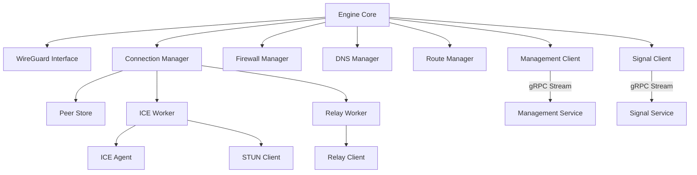
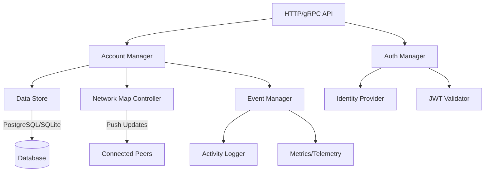
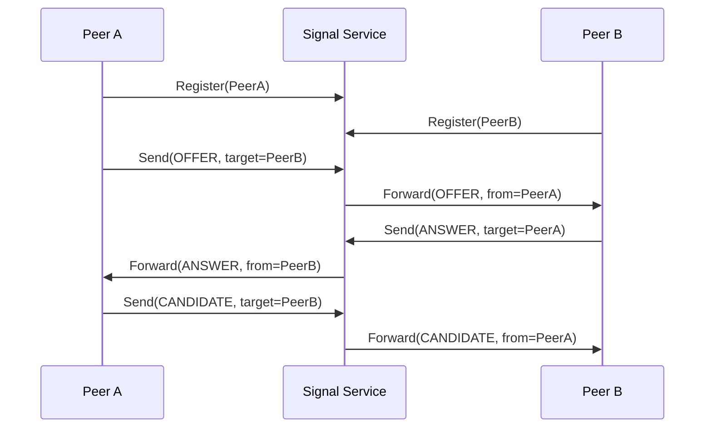

NetBird's architecture consists of several key components that work together to provide zero-configuration peer-to-peer networking. This page provides an in-depth look at each component's responsibilities and implementation.

## Client Agent

The NetBird client (also called agent) runs on each machine and is responsible for establishing and maintaining peer connections.

### Core Responsibilities

<AccordionGroup>
  <Accordion title="WireGuard Interface Management">
    The client manages a local WireGuard network interface (`wt0` by default).
    
    **Implementation** (`client/internal/engine.go`):
    
    ```go
    func (e *Engine) Start(netbirdConfig *mgmProto.NetbirdConfig, mgmtURL *url.URL) error {
        // Create WireGuard interface
        wgIface, err := e.newWgIface()
        
        // Configure with assigned IP and private key
        err = e.wgInterfaceCreate()
        
        // Bring interface up
        e.udpMux, err = e.wgInterface.Up()
    }
    ```
    
    **Capabilities:**
    - Interface creation and configuration
    - Kernel WireGuard (preferred) or userspace fallback
    - MTU configuration
    - Platform-specific optimizations (eBPF on Linux)
  </Accordion>
  
  <Accordion title="Peer Connection Management">
    Manages connections to all other peers in the network.
    
    **Connection Manager** (`client/internal/conn_mgr.go`):
    
    ```go
    type ConnMgr struct {
        config         *EngineConfig
        statusRecorder *peer.Status
        peerStore      *peerstore.Store
        wgInterface    WGIface
    }
    ```
    
    **Features:**
    - Parallel connection attempts (ICE + Relay)
    - Connection health monitoring
    - Automatic reconnection
    - Connection type switching (relay ↔ direct)
    - Lazy connection mode for resource efficiency
  </Accordion>
  
  <Accordion title="ICE Agent">
    Implements WebRTC ICE protocol for NAT traversal.
    
    **Key Functions** (`client/internal/peer/ice/`):
    
    - Candidate gathering (host, srflx, relay)
    - STUN binding requests
    - Connectivity checks
    - Network interface monitoring
    - Candidate prioritization
    
    Uses [pion/ice](https://github.com/pion/ice) library for WebRTC implementation.
  </Accordion>
  
  <Accordion title="Firewall Management">
    Applies network access policies locally.
    
    **Firewall Manager** (`client/firewall/manager`):
    
    ```go
    type Manager interface {
        AddPeerFiltering(ip net.IP, protocol Protocol, 
            port *Port, action Action) error
        AddRouteFiltering(sources []netip.Prefix, 
            destination Network) error
    }
    ```
    
    **Backend Implementations:**
    - **Linux**: nftables, iptables, or eBPF
    - **macOS**: pf (packet filter)
    - **Windows**: Windows Filtering Platform (WFP)
    - **Android/iOS**: Platform-specific APIs
  </Accordion>
  
  <Accordion title="DNS Management">
    Manages local DNS resolution and private DNS zones.
    
    **DNS Server** (`client/internal/dns/`):
    
    - Resolves NetBird private zones (*.netbird.cloud, custom domains)
    - Forwards queries to appropriate nameservers
    - Integrates with system DNS configuration
    - Handles split-horizon DNS
    
    **DNS Forwarder** for routing peer DNS queries.
  </Accordion>
  
  <Accordion title="Route Management">
    Applies network routes for accessing remote networks.
    
    **Route Manager** (`client/internal/routemanager/`):
    
    ```go
    type Manager interface {
        UpdateRoutes(serial uint64, serverRoutes, clientRoutes []*route.Route) error
        SetRouteChangeListener(listener NetworkChangeListener)
    }
    ```
    
    **Route Types:**
    - **Client routes**: Routes to access networks through routing peers
    - **Server routes**: Routes this peer advertises to others
    - **HA routes**: High-availability route groups
  </Accordion>
</AccordionGroup>

### Client Architecture



## Management Service

The Management Service is the centralized control plane that orchestrates the entire NetBird network.

### Core Responsibilities

#### 1. Authentication and Authorization

```go
// From management/server/peer.go
func (am *DefaultAccountManager) MarkPeerConnected(
    ctx context.Context, 
    peerPubKey string, 
    connected bool, 
    realIP net.IP, 
    accountID string,
) error {
    // Authenticate peer
    peer, err := am.Store.GetPeerByPeerPubKey(ctx, peerPubKey)
    
    // Update peer status and location
    updatePeerStatusAndLocation(ctx, am.geo, peer, connected, realIP)
}
```

**Authentication Methods:**

- **SSO Integration**: OAuth2/OIDC with providers (Google, Microsoft, Okta, etc.)
- **Setup Keys**: Pre-generated keys for bulk provisioning
- **JWT Validation**: Token-based authentication for API access
- **Service Accounts**: For automated peer registration

#### 2. Network State Management

**Account Structure** (`management/server/account.go`):

```go
type Account struct {
    Id                  string
    Peers               map[string]*nbpeer.Peer
    Groups              map[string]*Group
    Policies            []*Policy
    Routes              map[string]*route.Route
    DNSSettings         *DNSSettings
    Settings            *Settings
}
```

**State Includes:**

- Peer registry with metadata
- Access control policies (ACLs)
- Network routes
- DNS zones and nameservers
- User and group memberships
- Network configuration

#### 3. Network Map Distribution

```go
// From management/server/
func (am *DefaultAccountManager) GetNetworkMap(
    ctx context.Context,
    peerID string,
) (*NetworkMap, error) {
    account := am.Store.GetAccount(accountID)
    
    // Build network map for this peer
    networkMap := &NetworkMap{
        Peers:          am.getAccessiblePeers(peer, account),
        OfflinePeers:   am.getOfflinePeers(account),
        Routes:         am.getRoutesForPeer(peer, account),
        DNSConfig:      account.DNSSettings,
        FirewallRules:  am.getPeerFirewallRules(peer, account),
    }
    
    return networkMap, nil
}
```

**Network Map Contents:**

- **Remote Peers**: List of peers this peer can connect to
- **Access Policies**: Firewall rules and access controls
- **Routes**: Network routes to apply
- **DNS Config**: DNS zones, nameservers, custom records
- **STUN/TURN Servers**: Infrastructure server addresses

#### 4. Real-Time Updates

Management Service maintains streaming gRPC connections with all online peers:

```go
func (s *Server) Sync(
    req *proto.EncryptedMessage, 
    srv proto.ManagementService_SyncServer,
) error {
    // Establish long-lived stream
    peer := s.authenticatePeer(req)
    
    // Send initial network map
    srv.Send(s.getNetworkMap(peer))
    
    // Wait for network changes and push updates
    for update := range s.updateChannel {
        srv.Send(update)
    }
}
```

**Update Triggers:**

- Peer added/removed
- Policy changes
- Route modifications
- DNS configuration updates
- Group membership changes

### Management Service Architecture



### Data Storage

**Supported Backends:**

- **SQLite**: Default for single-instance deployments
- **PostgreSQL**: Recommended for production/HA deployments
- **In-Memory**: For testing

**Stored Data:**

- Account configurations
- Peer registry and metadata
- User accounts and permissions
- Access policies and rules
- Network routes
- Activity logs and events

## Signal Service

The Signal Service is a lightweight message relay for WebRTC signaling.

### Responsibilities

<CardGroup cols={2}>
  <Card title="Message Forwarding" icon="envelope">
    Relays encrypted offer/answer messages and ICE candidates between peers during connection establishment.
  </Card>
  <Card title="Peer Registration" icon="address-card">
    Maintains registry of connected peers and their signaling addresses.
  </Card>
  <Card title="Connection Metrics" icon="chart-line">
    Tracks peer connections, message counts, and latency metrics.
  </Card>
  <Card title="Stateless Design" icon="server">
    Does not store messages; forwards immediately or drops if recipient offline.
  </Card>
</CardGroup>

### Implementation

**Signal Exchange** (`signal/server/server.go`):

```go
type Server struct {
    registry *PeerRegistry  // Connected peers
    metrics  *Metrics       // Prometheus metrics
}

func (s *Server) Send(stream proto.SignalExchange_ConnectStreamServer) error {
    // Register peer
    peerID := authenticatePeer(stream)
    s.registry.Register(peerID, stream)
    
    // Forward messages
    for msg := range stream.Recv() {
        targetPeer := s.registry.Get(msg.RemoteKey)
        targetPeer.Send(msg)  // Forward encrypted message
    }
}
```

### Protocol

**Message Types:**

- `OFFER`: Initial connection offer with SDP and ICE candidates
- `ANSWER`: Connection answer in response to offer
- `CANDIDATE`: Additional ICE candidate discovered
- `GO_IDLE`: Request peer to close connection (lazy mode)

**Message Flow:**



### Security

<Warning>
  The Signal Service **never** decrypts peer messages. All offer/answer messages are encrypted by the sending peer before transmission.
</Warning>

**Encryption:**

- Messages encrypted with recipient's public key
- Signal Service only sees encrypted payload
- Forward secrecy maintained
- No message persistence

## Relay Servers (TURN)

Relay servers provide fallback connectivity when direct peer-to-peer connection fails.

### NetBird Relay Service

NetBird includes its own relay implementation (`relay/server/`):

```go
// From relay/server/server.go
type Server struct {
    relay     *Relay
    listeners []listener.Listener
}

func (r *Server) Listen(cfg ListenerConfig) error {
    // WebSocket listener for browser-compatible connections
    wSListener := &ws.Listener{Address: cfg.Address}
    
    // QUIC listener for better performance
    quicListener := &quic.Listener{Address: cfg.Address}
    
    // Accept connections and relay traffic
    go r.relay.Accept(listener)
}
```

### Relay Protocol

**Connection Process:**

1. Peer authenticates with relay using HMAC token from Management Service
2. Relay allocates relay address for peer
3. Peer communicates relay address to remote peer via Signal
4. Remote peer connects to relay address
5. Relay forwards encrypted WireGuard packets

### Performance Considerations

**Optimizations:**

- QUIC transport for reduced latency
- Zero-copy packet forwarding where possible
- Connection pooling
- Regional distribution for proximity

**Scaling:**

- Stateless design allows horizontal scaling
- Load balancing across multiple relay instances
- Geographic distribution for global deployments

### Coturn Alternative

NetBird also supports standard TURN servers like [Coturn](https://github.com/coturn/coturn):

**Configuration:**

```json
{
  "TURNConfig": {
    "Turns": [
      {
        "Proto": "udp",
        "URI": "turn:turn.example.com:3478",
        "Username": "user",
        "Password": "pass"
      }
    ]
  }
}
```

## Supporting Components

### STUN Servers

**Purpose**: Help peers discover their public IP addresses and ports as seen through NAT.

**Protocol**: RFC 5389 STUN (Session Traversal Utilities for NAT)

**Usage in NetBird:**

```go
// From client/internal/engine.go
func (e *Engine) updateSTUNs(stuns []*mgmProto.HostConfig) error {
    var newSTUNs []*stun.URI
    for _, s := range stuns {
        url, err := stun.ParseURI(s.Uri)
        newSTUNs = append(newSTUNs, url)
    }
    e.STUNs = newSTUNs
}
```

**Common STUN Servers:**

- `stun:stun.netbird.io:3478` (NetBird default)
- `stun:stun.l.google.com:19302` (Google)
- Self-hosted Coturn instances

### Admin Dashboard

Web-based UI for network management ([netbirdio/dashboard](https://github.com/netbirdio/dashboard)):

**Features:**

- Peer management and monitoring
- Access policy configuration
- Route management
- DNS zone configuration
- User and group administration
- Activity logs and audit trails
- Network topology visualization

**API Integration:**

- Consumes Management Service HTTP API
- Real-time updates via WebSocket
- OAuth2 authentication

## Component Communication

### Protocol Summary

<Tabs>
  <Tab title="Client ↔ Management">
    **Protocol**: gRPC over HTTP/2 with TLS
    
    **Port**: 443 (HTTPS) or custom
    
    **Messages**:
    - `Login`: Authenticate and get initial config
    - `Sync`: Long-lived stream for network map updates
    - `GetDeviceAuthorizationFlow`: SSO device flow
    
    **Features**:
    - Bidirectional streaming
    - Automatic reconnection
    - Compression
  </Tab>
  
  <Tab title="Client ↔ Signal">
    **Protocol**: gRPC over HTTP/2 with TLS
    
    **Port**: 10000 (default) or custom
    
    **Messages**:
    - `ConnectStream`: Register and receive messages
    - `Send`: Send encrypted offer/answer/candidate
    
    **Features**:
    - Bidirectional streaming
    - Message forwarding
    - End-to-end encryption
  </Tab>
  
  <Tab title="Client ↔ Relay">
    **Protocol**: WebSocket or QUIC over TLS
    
    **Port**: Variable
    
    **Traffic**: Encrypted WireGuard packets
    
    **Features**:
    - Token-based authentication
    - Low-latency forwarding
    - Connection multiplexing
  </Tab>
  
  <Tab title="Peer ↔ Peer">
    **Protocol**: WireGuard over UDP
    
    **Port**: Dynamic (NAT-assigned) or configured
    
    **Encryption**: WireGuard Noise protocol
    
    **Features**:
    - Direct P2P when possible
    - Through relay when necessary
    - End-to-end encryption always
  </Tab>
</Tabs>

## Deployment Patterns

### Self-Hosted

**Minimal Deployment:**

```yaml
services:
  management:
    image: netbirdio/management:latest
    ports:
      - "443:443"
      - "33073:33073"
  
  signal:
    image: netbirdio/signal:latest
    ports:
      - "10000:10000"
  
  coturn:
    image: coturn/coturn:latest
    ports:
      - "3478:3478/udp"
```

**Components Required:**

- Management Service
- Signal Service
- STUN/TURN server (Coturn or NetBird Relay)
- Database (PostgreSQL recommended)
- Identity Provider (or use hosted)

### NetBird Cloud

**Managed Components:**

- Management Service (multi-region)
- Signal Service (globally distributed)
- Relay servers (multiple regions)
- Admin Dashboard
- Identity Provider integration

**Client-Side Only:**

- NetBird client runs on your infrastructure
- Data flows peer-to-peer (not through cloud)
- Zero-knowledge architecture

## Next Steps

<CardGroup cols={2}>
  <Card title="Architecture Overview" icon="diagram-project" href="/architecture/overview">
    Understand the high-level design and principles
  </Card>
  <Card title="How It Works" icon="gears" href="/architecture/how-it-works">
    Learn about the connection flow and NAT traversal
  </Card>
</CardGroup>