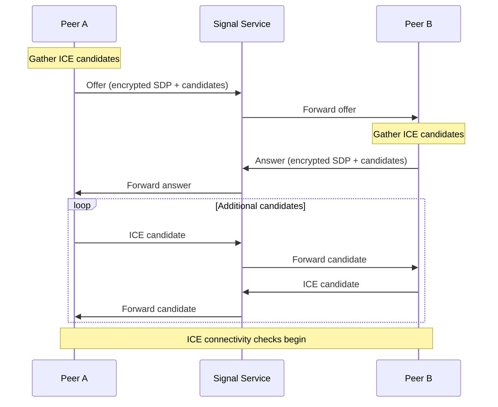

NetBird establishes peer-to-peer WireGuard connections using WebRTC's Interactive Connectivity Establishment (ICE) protocol. This page explains the detailed mechanics of how peers discover each other, traverse NATs, and establish encrypted tunnels.

## Connection Lifecycle

### 1. Peer Registration

When a NetBird client starts, it goes through the following registration process:

```go
// From client/internal/engine.go
func (e *Engine) Start(netbirdConfig *mgmProto.NetbirdConfig, mgmtURL *url.URL) error {
    // Create WireGuard interface
    wgIface, err := e.newWgIface()
    
    // Connect to Management Service with system info and authentication
    info := system.GetInfoWithChecks(e.ctx, e.checks)
    err = e.mgmClient.Sync(e.ctx, info, e.handleSync)
    
    // Start receiving signal events for peer negotiation
    e.receiveSignalEvents()
}
```

**Steps:**

1. **Authentication**: Client authenticates with Management Service using SSO or setup key
2. **Interface Creation**: Local WireGuard interface is created with assigned IP address
3. **System Info**: Client sends system metadata (OS, version, hostname, etc.)
4. **Network Map**: Management Service returns initial network map with:
   - List of peers to connect to
   - STUN/TURN server addresses
   - Access policies and routes
   - DNS configuration

### 2. Peer Discovery with ICE

NetBird uses the WebRTC ICE (Interactive Connectivity Establishment) protocol implemented by [pion/ice](https://github.com/pion/ice) to discover connection paths.

#### ICE Candidate Types

Each peer gathers multiple connection candidates:

<Tabs>
  <Tab title="Host Candidates">
    **Local network interfaces** - Direct IP addresses from network interfaces
    
    - Most preferred when both peers are on same LAN
    - Zero latency overhead
    - Example: `192.168.1.100:51820`
  </Tab>
  
  <Tab title="Server Reflexive (srflx)">
    **Public IP:port as seen by STUN server** - NAT's external mapping
    
    - Discovered by querying STUN servers
    - Enables direct connection through NAT
    - Example: `203.0.113.50:42133`
  </Tab>
  
  <Tab title="Relay Candidates">
    **TURN server relay address** - Fallback when direct connection fails
    
    - Always works but adds latency
    - Traffic flows through TURN server
    - Example: `relay.example.com:3478`
  </Tab>
</Tabs>

#### Candidate Discovery Process

```go
// From client/internal/peer/ice/agent.go
func (a *Agent) GatherCandidates() ([]*ice.Candidate, error) {
    // Gather local interface candidates
    hostCandidates := a.gatherHostCandidates()
    
    // Query STUN servers for reflexive candidates
    srflxCandidates := a.gatherServerReflexiveCandidates()
    
    // Get relay candidates from TURN servers
    relayCandidates := a.gatherRelayCandidates()
    
    return append(hostCandidates, srflxCandidates, relayCandidates...)
}
```

### 3. Signaling Through Signal Service

Once peers have their candidates, they exchange them through the Signal Service using an offer/answer pattern:



**Key Points:**

- All signaling messages are **encrypted** before being sent through Signal Service
- Signal Service only forwards messages; it cannot decrypt them
- Candidates are exchanged incrementally as they're discovered (trickle ICE)

### 4. NAT Traversal and Connectivity Checks

After candidate exchange, both peers perform connectivity checks to find the best path:

#### ICE Connectivity Check Process

1. **Candidate Pairing**: Each peer creates pairs of local and remote candidates
2. **Priority Calculation**: Pairs are prioritized (host > srflx > relay)
3. **STUN Binding Requests**: Peers send STUN binding requests to each candidate pair
4. **Connectivity Established**: First successful pair becomes the selected connection

```go
// From client/internal/peer/worker_ice.go
func (w *WorkerICE) OnRemoteCandidate(candidate ice.Candidate, haRoutes route.HAMap) {
    // Add remote candidate to ICE agent
    w.agent.AddRemoteCandidate(candidate)
    
    // Trigger connectivity checks
    w.agent.StartConnectivityChecks()
}
```

#### NAT Traversal Scenarios

<AccordionGroup>
  <Accordion title="Both peers behind different NATs (most common)">
    **Solution: STUN + UDP hole punching**
    
    1. Both peers discover their public endpoints via STUN
    2. Exchange srflx candidates through Signal Service
    3. Simultaneously send packets to each other's public endpoint
    4. NATs create symmetric mappings allowing bidirectional traffic
    
    This works for most residential/office NAT configurations.
  </Accordion>
  
  <Accordion title="One or both peers behind symmetric NAT">
    **Solution: TURN relay**
    
    Symmetric NATs assign different public ports for different destinations, breaking hole punching.
    
    - Peers connect through TURN relay server
    - Relay forwards packets between peers
    - Still maintains end-to-end WireGuard encryption
  </Accordion>
  
  <Accordion title="Same local network">
    **Solution: Direct host candidate connection**
    
    - Peers use local IP addresses directly
    - Zero-hop connection, lowest latency
    - Bypasses NAT entirely
  </Accordion>
  
  <Accordion title="Carrier-grade NAT (CGNAT)">
    **Solution: TURN relay required**
    
    Mobile networks and some ISPs use CGNAT (multiple layers of NAT).
    
    - Direct traversal usually fails
    - Relay connection provides fallback
    - NetBird automatically detects and falls back to relay
  </Accordion>
</AccordionGroup>

### 5. WireGuard Tunnel Establishment

Once ICE establishes a network path, NetBird creates the WireGuard tunnel:

```go
// From client/internal/peer/conn.go
func (conn *Conn) onConnected(remoteConn net.Conn, remoteKey string, 
    connType conntype.ConnType) {
    
    // Update WireGuard peer endpoint
    endpoint := remoteConn.RemoteAddr()
    conn.config.WgConfig.WgInterface.UpdatePeer(
        remoteKey,
        endpoint,
        conn.config.WgConfig.AllowedIps,
    )
    
    // Notify engine that peer is connected
    if conn.onConnected != nil {
        conn.onConnected(remoteKey, wireGuardIP, rosenpassAddr)
    }
}
```

**Tunnel Establishment:**

1. **Endpoint Configuration**: Selected ICE candidate pair becomes WireGuard endpoint
2. **Allowed IPs**: Configure which traffic should route through this peer
3. **WireGuard Handshake**: Standard WireGuard key exchange happens over the ICE connection
4. **Data Flow**: Encrypted packets flow directly between peers

### 6. Connection Monitoring and Failover

NetBird continuously monitors connection health and can switch between connection types:

```go
// From client/internal/peer/conn.go
func (conn *Conn) onGuardEvent(event guard.Event) {
    switch event {
    case guard.EventConnected:
        // Connection successfully established
    case guard.EventDisconnected:
        // Connection lost, attempt reconnection
        conn.workerICE.Reconnect()
        conn.workerRelay.Reconnect()
    case guard.EventTimeout:
        // Connection timeout, try alternative path
    }
}
```

**Connection Guard Features:**

- **Health Checks**: Regular WireGuard handshake monitoring
- **Reconnection**: Automatic reconnection on failure
- **Path Selection**: Switches from relay to direct when available
- **Network Changes**: Detects network changes and re-establishes connections

## Parallel Connection Attempts

NetBird attempts both direct (ICE) and relay connections simultaneously:

```go
// From client/internal/peer/conn.go
func (conn *Conn) Open(engineCtx context.Context) error {
    // Start relay worker
    conn.workerRelay = NewWorkerRelay(conn.ctx, conn.config, conn.relayManager)
    
    // Start ICE worker in parallel
    conn.workerICE = NewWorkerICE(conn.ctx, conn.config, conn.signaler)
    
    // Guard monitors both and selects the best connection
    conn.guard = guard.NewGuard(conn.isConnectedOnAllWay, timeout)
}
```

**Connection Priority:**

1. **Direct P2P (ICE)**: Always preferred for performance
2. **Relay**: Used as immediate fallback if ICE takes too long
3. **Upgrade**: Can upgrade from relay to direct if P2P succeeds later

<Info>
  The timeout for initial connection attempts is randomized between 30-45 seconds to prevent thundering herd problems in large networks.
</Info>

## Network Updates and Reconnections

When network conditions change, NetBird handles reconnection automatically:

### Network Change Detection

```go
// From client/internal/engine.go
func (e *Engine) startNetworkMonitor() {
    e.networkMonitor.Start()
    go func() {
        for event := range e.networkMonitor.Events() {
            // Network interface changed
            e.handleNetworkChange(event)
        }
    }()
}
```

**Triggers:**

- WiFi to cellular transition
- VPN connection/disconnection
- IP address changes
- Network interface up/down events

### Management Service Synchronization

The Management Service pushes real-time updates through a streaming gRPC connection:

```go
// From client/internal/engine.go
func (e *Engine) receiveManagementEvents() {
    e.mgmClient.Sync(e.ctx, info, e.handleSync)
}

func (e *Engine) handleSync(update *mgmProto.SyncResponse) error {
    // Handle network map updates
    e.updateNetworkMap(update.GetNetworkMap())
    
    // Update STUN/TURN servers
    e.updateSTUNs(update.GetNetbirdConfig().GetStuns())
    e.updateTURNs(update.GetNetbirdConfig().GetTurns())
}
```

**Update Types:**

- New peers added to network
- Peers removed from network
- Access policy changes
- Route updates
- DNS configuration changes
- STUN/TURN server changes

## Performance Optimizations

### eBPF-Based Proxy

On Linux, NetBird can use eBPF for efficient packet handling:

- Reduces context switches between kernel and userspace
- Transparent connection tracking
- Minimal CPU overhead for high-throughput scenarios

### UDP Mux

Multiple peer connections share a single UDP port:

```go
// From client/internal/engine.go
type EngineConfig struct {
    UDPMuxPort      int // Single port for all WireGuard connections
    UDPMuxSrflxPort int // Single port for server-reflexive candidates
}
```

Benefits:
- Reduces number of required firewall ports
- Simplifies NAT traversal
- Enables better connection tracking

### Connection Type Optimization

NetBird continuously evaluates connection quality:

- Prefers direct connections over relayed
- Monitors latency and packet loss
- Automatically switches to better path when available

## Troubleshooting Connection Issues

<AccordionGroup>
  <Accordion title="Peers stuck on relay connection">
    **Causes:**
    - Strict firewall blocking UDP
    - Symmetric NAT on both sides
    - STUN server unreachable
    
    **Solutions:**
    - Check firewall allows UDP outbound
    - Verify STUN servers are accessible
    - Use `netbird status` to check connection type
  </Accordion>
  
  <Accordion title="Connection timeout">
    **Causes:**
    - Firewall blocking Signal/Management service
    - No available TURN servers
    - Network policy blocking VPN traffic
    
    **Solutions:**
    - Verify connectivity to Management Service
    - Check TURN server configuration
    - Review firewall logs for blocked connections
  </Accordion>
  
  <Accordion title="Frequent reconnections">
    **Causes:**
    - Unstable network
    - NAT session timeout too short
    - Keepalive interval too long
    
    **Solutions:**
    - Adjust WireGuard PersistentKeepalive setting
    - Check for network interface flapping
    - Review network quality metrics
  </Accordion>
</AccordionGroup>

## Next Steps

<CardGroup cols={2}>
  <Card title="Architecture Overview" icon="diagram-project" href="/architecture/overview">
    High-level architecture and design principles
  </Card>
  <Card title="Components" icon="cubes" href="/architecture/components">
    Detailed component responsibilities and interactions
  </Card>
</CardGroup>