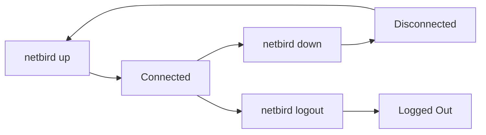

## Overview

The `netbird down` command disconnects your device from the NetBird network and terminates all active peer-to-peer connections.

```bash
netbird down
```

## Description

This command performs the following actions:

1. Tears down all peer-to-peer connections
2. Disconnects from the management server
3. Removes routes and DNS configuration
4. Brings down the WireGuard interface (but does not remove it)
5. Stops firewall rules

<Info>
  The `netbird down` command does not:
  - Uninstall the NetBird service
  - Log you out (your authentication remains valid)
  - Delete configuration files
  
  Use `netbird logout` to clear authentication or `netbird service uninstall` to completely remove NetBird.
</Info>

## Flags

This command uses only the global flags. See [CLI Overview](/cli/overview#global-flags) for available options.

## Examples

### Basic Disconnect

Disconnect from the NetBird network:

```bash
netbird down
```

Output:
```
Disconnected
```

### Verify Disconnection

Check status after disconnecting:

```bash
netbird down
netbird status
```

The status will show the connection is down.

### Disconnect and Stop Service

To disconnect and prevent automatic reconnection:

```bash
netbird down
netbird service stop
```

## Behavior

### What Happens When You Disconnect

1. **Peer Connections**: All active WireGuard tunnels to peers are terminated
2. **Management Connection**: The connection to the management server is closed
3. **Network Interface**: The WireGuard interface (e.g., `wt0`) is brought down but not deleted
4. **DNS Configuration**: Custom DNS settings are removed, system DNS is restored
5. **Routes**: NetBird-managed routes are removed from the routing table
6. **Firewall**: NetBird-specific firewall rules are removed

### What Persists After Disconnection

- **Authentication tokens**: You remain logged in
- **Configuration files**: All settings are preserved in `/etc/netbird/config.json`
- **Service installation**: The NetBird service remains installed
- **Logs**: Historical logs are retained

### Auto-Reconnection

If auto-connect is enabled (default), the NetBird daemon will automatically reconnect when:

- The service is restarted
- The system reboots
- Network connectivity is restored

To disable auto-reconnection:

```bash
netbird up --disable-auto-connect
```

Or stop the service:

```bash
netbird service stop
```

## Use Cases

### Temporary Disconnection

Disconnect temporarily while keeping the service running:

```bash
netbird down
```

Reconnect later:

```bash
netbird up
```

### Troubleshooting

Reset the connection to resolve connectivity issues:

```bash
netbird down
sleep 2
netbird up
```

### Switch Networks or Profiles

Disconnect before switching to a different profile:

```bash
netbird down
netbird up --profile work
```

### Maintenance Mode

Disconnect during system maintenance:

```bash
netbird down
netbird service stop
# Perform maintenance
netbird service start
netbird up
```

## Status Messages

- `Disconnected` - Successfully disconnected from the NetBird network
- `failed to connect to daemon` - The NetBird daemon is not running

## Common Issues

### Daemon Not Running

```
failed to connect to daemon error: connection refused
```

**Solution:** The daemon is already stopped or not installed. If you want to ensure NetBird is completely stopped:

```bash
netbird service stop
```

### Permission Denied

On some systems, you may need elevated privileges:

```bash
sudo netbird down
```

## Related Commands

- [netbird up](/cli/up) - Connect to the NetBird network
- [netbird status](/cli/status) - Check connection status
- [netbird logout](/cli/login) - Log out and clear authentication
- [netbird service stop](/cli/service) - Stop the NetBird service

## Technical Details

### Connection Lifecycle



### Cleanup Actions

When you run `netbird down`, NetBird performs cleanup in this order:

1. Close all peer WireGuard connections
2. Stop DNS resolver
3. Remove custom routes
4. Clear firewall rules
5. Bring down WireGuard interface
6. Close management connection
7. Update local state to "disconnected"

### Network Interface State

The WireGuard interface remains in the system but in a "down" state:

```bash
# Before disconnect
ip link show wt0
# 4: wt0: <POINTOPOINT,NOARP,UP,LOWER_UP> mtu 1280

# After disconnect
ip link show wt0
# 4: wt0: <POINTOPOINT,NOARP> mtu 1280
```

The interface will be brought back up on the next `netbird up` command.
